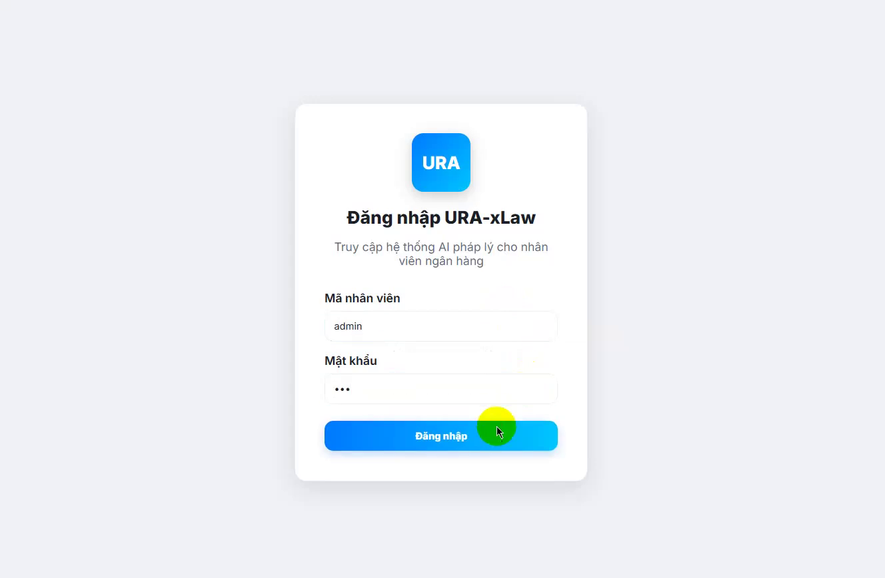
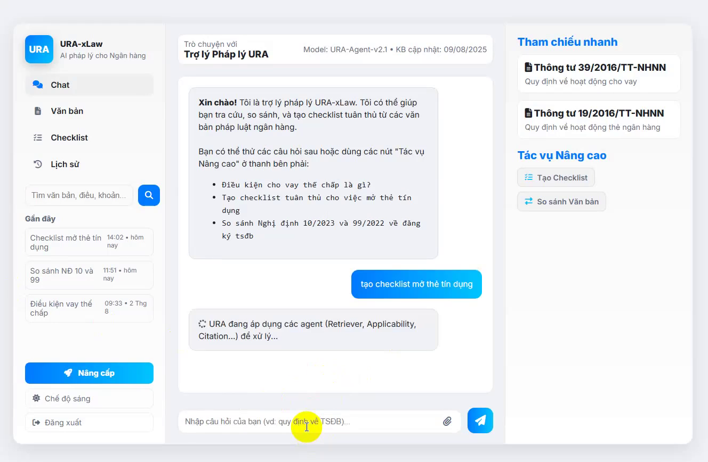
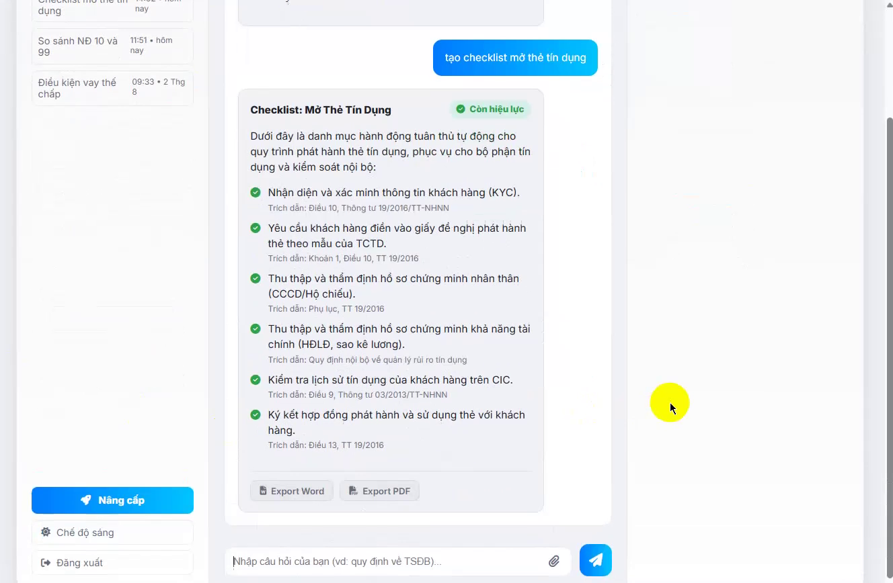
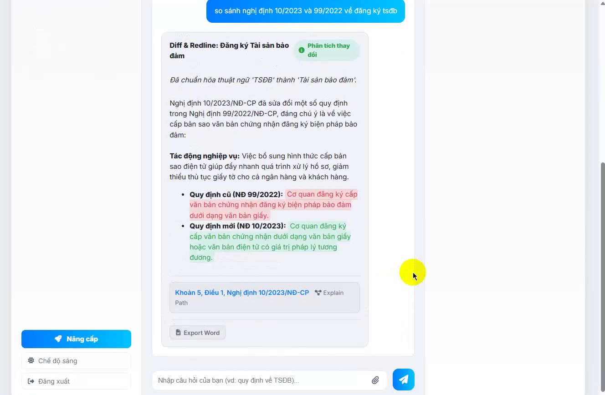
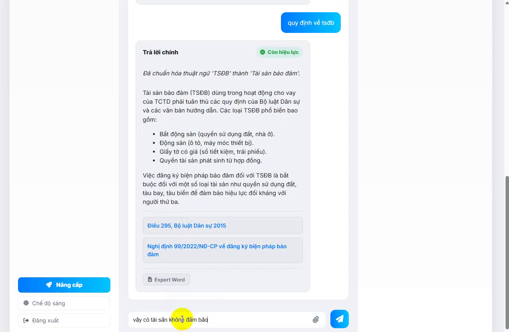
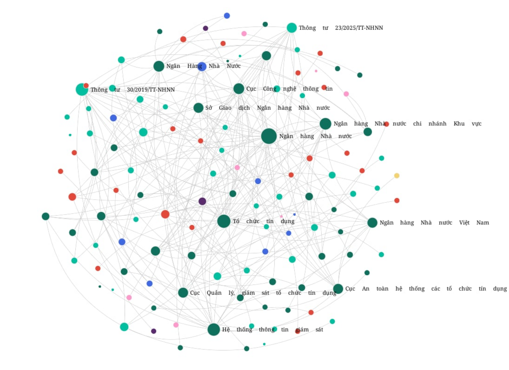

# URA‑xLaw — Nền tảng AI tư vấn hỏi–đáp văn bản pháp luật NHNN

Dự án URA‑xLaw là nền tảng RegTech/LegalTech chuyên sâu cho hệ sinh thái ngân hàng Việt Nam. Hệ thống kết hợp LawRAG (Retrieval‑Augmented Generation tối ưu cho ngôn ngữ pháp lý tiếng Việt) và LawGraph (đồ thị tri thức pháp luật mô hình hóa quan hệ sửa đổi/bãi bỏ/tham chiếu/áp dụng theo trục thời gian), được điều phối bởi kiến trúc AI multi‑agent nhằm tạo câu trả lời chính xác, có trích dẫn, có khả năng kiểm chứng và giải thích đường viện dẫn.

Các điểm nhấn:
- Trả lời có trích dẫn Điều/Khoản bắt buộc (no‑citation → no‑answer)
- Suy luận hiệu lực theo thời gian và phạm vi áp dụng
- Multi‑hop retrieval kết hợp chỉ mục ngữ nghĩa + đồ thị tri thức
- Tính năng Diff & Redline (so sánh phiên bản) và Checklist tuân thủ
- Sẵn sàng triển khai on‑prem/private cloud cho yêu cầu bảo mật cao

---

## Kiến trúc & Công nghệ (tóm tắt)

- LawRAG: RAG chuyên miền luật tiếng Việt, chunk theo Điều/Khoản, hybrid retrieval, multi‑hop
- LawGraph: đồ thị tri thức mô hình hóa sửa đổi/bãi bỏ/tham chiếu/áp dụng/ngoại lệ + hiệu lực theo thời gian
- AI Multi‑Agent: Intent & Normalize → Retriever → Applicability & Effectivity → Citation & Guardrail
- Backend: LightRAG API (FastAPI/Uvicorn), cấu hình qua .env + config.ini, đóng gói Docker
- Frontend: Vite + React + TypeScript, streaming endpoint `/query/stream`

### Ảnh chụp màn hình

> Một số màn hình chính phản ánh trải nghiệm Answer Card gọn gàng, huy hiệu hiệu lực, trích dẫn Điều/Khoản và các tiện ích Diff/Checklist.

- Đăng nhập:  
  

- Giao diện Chat và Answer Card:  
  

- Checklist tuân thủ tự động:  
  

- So sánh phiên bản (Diff & Redline):  
  

- Truy hồi đa bước & chuẩn hóa thuật ngữ:  
  

### Kiến trúc qua hình ảnh

- LawGraph: mô hình hóa quan hệ pháp lý và trạng thái hiệu lực theo thời gian.  
  

- AI Multi‑Agent Orchestration: điều phối, hậu kiểm và cập nhật dữ liệu dựa trên LawRAG.  
  

---

## Yêu cầu hệ thống

- Hệ điều hành: Windows, macOS, hoặc Linux
- Docker Desktop + Docker Compose v2
- Node.js 20+ và npm 9+
- Truy cập internet (nếu dùng dịch vụ LLM/embedding bên ngoài như OpenAI)

Lưu ý: Cấu hình mặc định backend dùng OpenAI (gpt‑4o) cho LLM và Ollama cho embedding. Nếu bạn không chạy Ollama cục bộ, hãy chuyển embedding sang nhà cung cấp khác (ví dụ OpenAI) hoặc cập nhật EMBEDDING_BINDING_HOST cho phù hợp.

---

## Cấu trúc thư mục

```
URAxLaw-backend/      # Backend LightRAG API + phục vụ ingest/QA + đồ thị tri thức
  ├─ docker-compose.yml
  ├─ Dockerfile
  ├─ env.example      # Mẫu biến môi trường -> sao chép thành .env
  ├─ config.ini.example -> sao chép thành config.ini
  ├─ data/
  │   ├─ inputs/      # Nơi đặt tài liệu nguồn để xử lý
  │   ├─ rag_storage/ # Chỉ mục/đồ thị/metadata sau xử lý
  │   └─ tiktoken/    # Bộ nhớ đệm tiktoken (tối ưu offline)
  └─ lightrag/…

URAxLaw-frontend/     # Ứng dụng web (Vite + React + TS)
  ├─ package.json
  ├─ vite.config.ts
  └─ src/
      ├─ api/client.ts # Nơi cấu hình API base URL và API key giao tiếp backend
      └─ components/…

images/                # Tài nguyên hình ảnh dùng trong README
  ├─ LawGraph.png
  ├─ AI Multi-agent architecture.png
  ├─ UI_1_Login.png
  ├─ UI_2_Chat.png
  ├─ UI_3_Checklist.png
  ├─ UI_4_DiffRedline.png
  └─ UI_5_Retreieve_and_term_normalization.png
```

---

## Cấu hình Backend (bắt buộc trước khi chạy)

Tạo file .env từ mẫu và điều chỉnh biến môi trường cần thiết:

```bash
cd URAxLaw-backend
cp env.example .env
```

Các biến quan trọng trong .env:
- Server
  - HOST=0.0.0.0, PORT=9621 (cổng đã được docker-compose ánh xạ mặc định)
  - CORS_ORIGINS= http://localhost:5173, http://localhost:3000 … (nếu cần)
- Bảo mật (tùy chọn bật API key/JWT)
  - LIGHTRAG_API_KEY=your-secure-api-key-here (nếu đặt, backend sẽ yêu cầu header/query tương ứng)
  - TOKEN_SECRET, TOKEN_EXPIRE_HOURS, GUEST_TOKEN_EXPIRE_HOURS…
- LLM
  - LLM_BINDING=openai | ollama | azure_openai | …
  - LLM_MODEL=gpt-4o (ví dụ)
  - LLM_BINDING_HOST=https://api.openai.com/v1
  - LLM_BINDING_API_KEY=your_api_key
- Embedding
  - EMBEDDING_BINDING=ollama | openai | jina | …
  - EMBEDDING_MODEL=bge-m3:latest (ví dụ với Ollama)
  - EMBEDDING_BINDING_HOST=http://localhost:11434 (đổi nếu không chạy Ollama cục bộ)
- Kho dữ liệu 
  - Chọn KV/Vector/Graph storage (Redis/Mongo/Postgres/Neo4j/Milvus/Qdrant …) nếu triển khai production


---

## Chạy Backend

Chỉ cần Docker Compose:

```bash
cd URAxLaw-backend
docker compose up -d
```

- Backend phục vụ tại http://localhost:9621
- Docker volumes (data/*, config.ini, .env) đã được mount theo docker-compose.yml
- Log: dùng `docker compose logs -f` để theo dõi khởi động

---

## Cấu hình Frontend

Frontend đã mặc định trỏ API về http://localhost:9621 (xem src/api/client.ts). Bạn có thể đổi qua biến môi trường Vite nếu cần:

- Tạo file .env.local trong URAxLaw-frontend/ (tuỳ chọn)

```bash
VITE_API_BASE_URL=http://your-backend-host:9621
```

- Hoặc chỉnh trực tiếp thông qua client.ts (không khuyến nghị trong production).

API key (nếu backend bật):
- Backend chấp nhận API key qua header hoặc query param với tên khóa api_key_header_value.
- Giá trị này phải bằng LIGHTRAG_API_KEY trong backend .env.
- Frontend đã hỗ trợ cả 2 cách trong src/api/client.ts:
  - Mặc định gửi ở header: { 'api_key_header_value': '<API_KEY>' }
  - Có thể chuyển sang dạng query string nếu cần.

---

## Chạy Frontend (dev)

```bash
cd URAxLaw-frontend
npm install
npm run dev
```

- Mặc định Vite chạy ở http://localhost:5173
- Ứng dụng sẽ gọi API backend tại VITE_API_BASE_URL (mặc định http://localhost:9621)

Build/preview (tùy chọn):

```bash
npm run build
npm run preview
```

---

## Bảo mật, CORS và xác thực

- Đặt LIGHTRAG_API_KEY trong backend .env để yêu cầu API key khi truy cập API
- Tên header/query: `api_key_header_value`
- Cấu hình CORS qua biến môi trường CORS_ORIGINS nếu frontend và backend chạy trên domain/port khác nhau
- Có thể bật SSL (SSL=true, SSL_CERTFILE, SSL_KEYFILE) khi cần
- Tuân thủ Nghị định 13/2023 về bảo vệ dữ liệu cá nhân; hướng tới kiểm toán ISO/IEC 27001 (khi thương mại hóa)

---

## Troubleshooting

- 401 Unauthorized: Thiếu/không khớp API key. Kiểm tra LIGHTRAG_API_KEY (backend) và api_key_header_value (frontend)
- Backend không lên: Kiểm tra cổng 9621 có bị chiếm; xem `docker compose logs -f`; kiểm tra LLM/Embedding cấu hình
- Embedding Ollama lỗi: Chỉnh EMBEDDING_BINDING_HOST (trong .env) hoặc chuyển sang EMBEDDING_BINDING=openai+jina
- CORS lỗi: Thêm frontend origin vào CORS_ORIGINS trong .env backend
- Streaming không hiển thị: Kiểm tra endpoint `/query/stream` và kết nối mạng; xem console trình duyệt

---

## Tuỳ biến & mở rộng

- Thay đổi nhà cung cấp LLM/Embedding qua biến .env
- Nâng cấp storage (Redis/Mongo/Postgres/Neo4j/Milvus/Qdrant) cho production
- Tinh chỉnh tham số truy hồi: TOP_K, CHUNK_TOP_K, MAX_*_TOKENS, KG_CHUNK_PICK_METHOD, RERANK_*…

---

## Giấy phép & Ghi công

- Backend sử dụng LightRAG (xem LICENSE trong URAxLaw-backend). Các quyền và điều kiện tuân theo giấy phép của dự án gốc.
- Mọi nhãn hiệu và tên sản phẩm thuộc về chủ sở hữu tương ứng.

---

## Liên hệ

Đội ngũ URAx — Trường Đại học Bách khoa – ĐHQG‑HCM  
Email: long.nguyencse2023@hcmut.edu.vn — Điện thoại: 0837026259

---

## Phụ lục A — Tính năng cốt lõi (rút gọn từ tài liệu dự án)

- Trả lời có trích dẫn Điều/Khoản bắt buộc; thiếu căn cứ → trả lời “không có đủ căn cứ” (no‑answer)
- Suy luận hiệu lực theo thời gian, đối tượng áp dụng; gắn badge Còn hiệu lực/Hết hiệu lực/Dự thảo
- Explain Path (mini‑graph) giải thích đường viện dẫn/sửa đổi dẫn tới kết luận hiện hành
- Diff & Redline theo Điều/Khoản; lượng hóa thay đổi và tác động nghiệp vụ
- Checklist tuân thủ tự động kèm trích dẫn; xuất Word/PDF
- Change‑Watcher tự động theo dõi nguồn chính thống, crawl → diff → cập nhật chỉ mục/LawGraph ≤ 24h

## Phụ lục B — Đối tượng & Use‑case tiêu biểu

- Pháp chế, KSNB, kiểm toán nội bộ: rà soát nhanh, chuẩn hóa bằng chứng, audit trail đầy đủ
- Khối tín dụng/nghiệp vụ: quyết định nhanh với badge hiệu lực/phạm vi áp dụng, dùng Diff để lượng hóa tác động
- Cố vấn pháp lý, học thuật: truy vấn có trích dẫn chính thống, phục vụ đào tạo/nghiên cứu

## Phụ lục C — Chỉ số mục tiêu & SLA (tham khảo)

- P95 latency < 2 giây; SLA uptime 99% (cloud)
- SLA cập nhật dữ liệu ≤ 24 giờ qua Change‑Watcher
- Precision mục tiêu ≥ 90%, Recall ≥ 85%; 100% trả lời có ≥ 1 trích dẫn hợp lệ

## Phụ lục D — Gói sản phẩm (định vị)

- SOLO: cá nhân/SME tra cứu nhanh
- TEAM: nhóm pháp chế/fintech cộng tác
- ENTERPRISE CLOUD: tổ chức tài chính cần API, SLA, tích hợp hệ thống
- ENTERPRISE SUITE (on‑prem/private cloud): triển khai nội bộ, bảo mật cao
